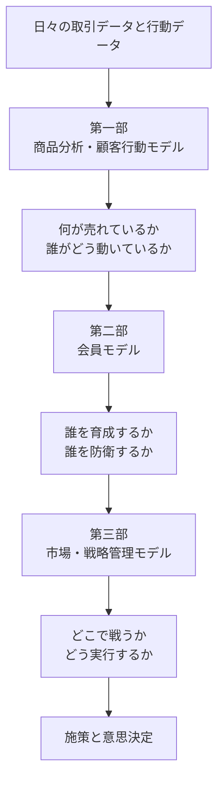

# データ分析ビジネスモデル（総覧）

この総覧は、次の三篇を一枚で読み通すための案内図である。

- [データ分析ビジネスモデル (一)](./データ分析ビジネスモデル%20(一).md)：商品と顧客行動をどう読むかを整理する。
- [データ分析ビジネスモデル (二)](./データ分析ビジネスモデル%20(二).md)：会員をどう識別し、どう運用するかを整理する。
- [データ分析ビジネスモデル (三)](./データ分析ビジネスモデル%20(三).md)：市場をどう見て、戦略と実行へどうつなぐかを整理する。

この三篇は並列の知識集ではない。第一部で日々の取引や顧客行動を読み、第二部で個客単位の運用へ落とし込み、第三部で市場と戦略の視点から全体を見直す。こう読むと、モデルがばらばらな用語ではなく、実務の流れとしてつながる。

## 1. 読書導図

## 2. 三篇の役割分担

| 層 | 文書 | 主な問い | 代表モデル | 役割 |
| --- | --- | --- | --- | --- |
| 取引・行動把握 | [データ分析ビジネスモデル (一)](./データ分析ビジネスモデル%20(一).md) | 何が売れ、誰がどう行動しているか | パレート、RFM、AARRR、コホート分析 | 商品構成と顧客行動を読む |
| 個客運用 | [データ分析ビジネスモデル (二)](./データ分析ビジネスモデル%20(二).md) | 誰をどう分類し、どう育成・防衛するか | クラスタリング、会員タグ、Lifetimes | 会員単位の運用へ落とし込む |
| 市場・戦略 | [データ分析ビジネスモデル (三)](./データ分析ビジネスモデル%20(三).md) | どの市場で、どの価値で戦い、どう改善するか | PEST、STP、PMF、SWOT、PDCA | 外部環境と戦略実行をつなぐ |

## 3. 第一部の見取り図

第一部は、今回「商品分析・顧客行動モデル」という名前に整理し直した。理由は、収録モデルが単なる抽象的なデータモデルではなく、内容として二つのまとまりを持っているからである。

### 前半：商品分析寄りの四つ
- パレートモデル
- ロングテールモデル
- ボストンモデル
- マーケットバスケット分析

この四つは、商品構成、売れ筋、尾部需要、併売関係、資源配分といった「商品と施策の構造」を見るのに強い。

### 後半：顧客行動寄りの六つ
- デシル分析
- RFMモデル
- AARRRモデル
- AISASモデル
- コホート分析
- コンバージョンファネル分析

この六つは、顧客価値、継続、行動導線、成長ボトルネックを捉えるのに強い。前半が「何が成果を生んでいるか」を見るなら、後半は「誰が、どういう経路で成果を生んでいるか」を見るための群だと理解するとよい。

## 4. 第二部の見取り図

第二部は、会員データを使った個客運用の基本セットとして読める。

1. **クラスタリングモデル**：まだ名前のない顧客群を発見する。
2. **会員タグ**：発見した違いを、施策で使える言葉に変換する。
3. **Lifetimes モデル**：将来の離脱や価値を予測し、優先順位をつける。

この流れは、探索、定義、予測の三段階に近い。つまり、第二部は「顧客を知る」だけでなく、「顧客ごとに何をするか」を決めるための文書である。

## 5. 第三部の見取り図

第三部は、市場を見るモデルと、戦略を回すモデルが一つにまとまっている。

### 外部環境と競争を見るモデル
- PEST分析
- ポーターの五力分析
- STP分析
- 4P
- Product / Market Fit

これらは、市場の変化、競争圧力、狙う顧客、提供価値を整理するために使う。

### 実行と改善を進めるモデル
- GROWモデル
- SWOT分析
- PDCAサイクル

これらは、戦略を会議資料の中で止めず、具体的な実行と改善へつなげるために使う。

## 6. 三篇を一続きで読む流れ

1. 第一部で、商品と顧客行動の基本的な見方をつかむ。
2. 第二部で、会員単位の運用へどう落とすかを理解する。
3. 第三部で、市場、戦略、改善サイクルまで視野を広げる。

要するに、この三篇は次の一文にまとめられる。

> 第一部で取引と行動を読み、第二部で個客運用へ落とし込み、第三部で市場と戦略へ接続する。

この順で読むと、モデルを個別に暗記するよりも、どの場面でどのモデルを使うかが見えやすくなる。