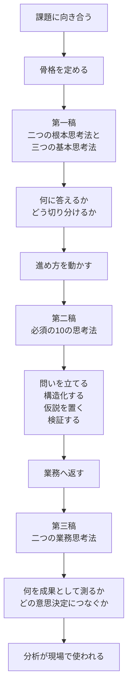

# データ分析思考法（総覧）

この総覧は、次の三篇を一枚で読み通すための案内図である。

- [データ分析思考法（一）](./データ分析思考法（一）.md)：分析の骨格をつくる。
- [データ分析思考法（ニ）](./データ分析思考法（ニ）.md)：分析を前へ進める手順を整える。
- [データ分析思考法（三）](./データ分析思考法（三）.md)：分析結果を業務成果と意思決定へ接続する。

三篇の関係は、単なる並列ではない。第一稿で分析の設計図をつくり、第二稿でその設計図を使って実務を進め、第三稿で分析を業務成果へ返す。この順で読むと、思考法がばらばらな知識ではなく、一つの流れとして理解しやすい。

## 1. 読書導図

## 2. 三篇の役割分担

| 層 | 文書 | 中心テーマ | 役割 | 読むときの着眼点 |
| --- | --- | --- | --- | --- |
| 骨格 | [データ分析思考法（一）](./データ分析思考法（一）.md) | 根本思考と基本思考 | 分析の設計図を定める | 「何に答えるか」と「どう見るか」の土台をつくっているか |
| 進め方 | [データ分析思考法（ニ）](./データ分析思考法（ニ）.md) | 必須の10の思考法 | 分析を実務で前へ進める | どの順で問いを絞り、仮説と検証へ進むか |
| 業務接続 | [データ分析思考法（三）](./データ分析思考法（三）.md) | 指標思考とビジネス思考 | 分析結果を成果基準と意思決定へ返す | 数字を何のために測り、誰の意思決定に返すのか |

## 3. 第一稿の見取り図

第一稿が「骨格」と呼ばれるのは、重要だからではなく、分析全体の設計図を決める層だからである。

- ピラミッド原則：答えるべき問いと結論の階層を定める。
- MECE法：論点を漏れなく重なりなく切り分ける。
- 比較思考：差を見つける。
- 細分化思考：どこで差が生まれているかを特定する。
- トレンド思考：時間変化と転換点をつかむ。

ここで特に区別したいのは、MECE法と細分化思考である。

- MECE法は、論点の箱をどう作るかを決める構造設計である。
- 細分化思考は、その箱を使って実際の数字を掘り、異常箇所や改善余地を特定する運用動作である。

似て見えても、前者は切り分けの規律、後者は切り分けた後の診断であり、役割が異なる。

## 4. 第二稿の読み方

第二稿の10の思考法は、重要度の順位ではなく、分析を前へ進める順番に近い。

1. 目標思考と構造的思考で、問いと論点を整える。
2. 帰納、演繹、仮説、追跡で、原因仮説と検証の筋道をつくる。
3. 相関、逆向、事実、5W2H・3Wで、視点を広げ、見落としを減らす。

第一稿が「骨組み」だとすれば、第二稿はその骨組みを使って実際に歩くための手順書である。

## 5. 第三稿の読み方

第三稿は、分析を数字の説明で終わらせないための文書である。

- 指標思考：業務を測れる形に翻訳する。
- ビジネス思考：その数字をどの意思決定へ返すかを考える。

この二つが加わることで、分析は「何が起きたか」の説明から、「次に何を決めるべきか」の支援へ進む。

## 6. 三篇を一続きで読むときの流れ

1. 第一稿で、問い、論点、観察の基本動作をつかむ。
2. 第二稿で、それらを実務の進行順に並べ直し、仮説と検証の回し方を理解する。
3. 第三稿で、指標設計と意思決定接続を加え、分析を業務成果へ閉じる。

要するに、この三篇は次の一文にまとめられる。

> 第一稿で骨格を定め、第二稿で進め方を身につけ、第三稿で業務成果へ接続する。

この一続きの流れを意識すると、各思考法を個別に暗記するよりも、実務でどの段階に何を使うかが見えやすくなる。